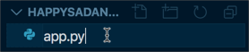
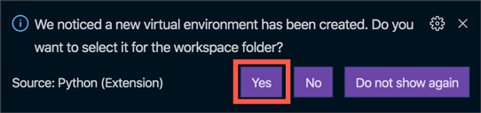
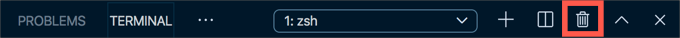
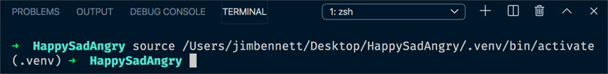

# Create the Flask web app

In this step you will create a Flask web app.

## Create folders for the project

1. Create a folder called `HappySadAngry` somewhere on your machine.

## Open this folder in Visual Studio Code

1. Launch Visual Studio Code.

1. Open the newly created folder
   1. On MacOS select *File->Open...*
   1. On Windows select *File->Open Folder...*

1. Navigate to the new `HappySadAngry` folder and select **Open**.

You will see the empty folder appear in the *Explorer*.

## Configure a virtual environment

Python comes in various versions, and Python apps can use external code in packages installed via a tool called `pip`. This can lead to problems if different apps need different package versions, or different Python versions. To make it easier to avoid issues with package or Python versions, it is best practice to use *virtual environments*, self-contained folder trees that contain a Python installation for a particular version of Python, plus a number of additional packages.

1. Create a new file inside the `HappySadAngry` folder called `app.py`. This is the file that will contain the code for the Flask app, and by creating it the Python extension in Visual Studio Code will be activated. Select the **New File** button in the *Explorer*.

   

1. Name the new file `app.py` and press return

   

   > You may be prompted to install a Linter. This is a tool that can inspect your code for error as you write it. If a popup appears asking if you want to install this, select **Install**.

1. When Visual Studio Code was opened, the terminal should be opened by default. If not, open a new terminal by selecting *Terminal -> New Terminal*.

1. Create a new virtual environment called `.venv` using Python 3 by running the following command in the terminal

   ```sh
   python3 -m venv .venv
   ```

1. A dialog will pop up asking if you want to activate this virtual environment. Select **Yes**.

   

1. The existing terminal will not have the virtual environment activated. Close it by selecting the trash can button

   

1. Create a new terminal by selecting *Terminal -> New Terminal*. The terminal will load the virtual environment

   

## Install the Flask package

[Flask](http://flask.pocoo.org) is a Python micro-framework for creating Web Apps. It is lightweight and easy to use to create simple Web Apps. It is available as a Python package that can be installed with `pip`.

Instead of installing it using `pip` from the terminal, it should be configured inside a `requirements.txt` file. This file lists all the packages that a Python app depends on, and will be needed once the Web App is deployed to the cloud in a later step. This file will tell whatever server in the cloud that the web site is running on that packages that have to be installed before the Web App can be started.

1. Create a new file in the folder called `requirements.txt`

1. Add the following package to the file:
  
   ```python
   flask
   ```

1. Save the file

   > If you don't want to have to remember to always save files, you can turn on Auto Save by selecting *File -> Auto Save*.

1. Install the packages from the terminal using the following command:
  
   ```sh
   pip install -r requirements.txt
   ```

   This will install all packages in the `requirements.txt` file, skipping any that are already installed.

## Write the code

1. Open the `app.py` file

1. Add the following code to this file:
  
    ```python
    from flask import Flask

    app = Flask(__name__)

    @app.route('/')
    def home():
      return 'Hello World'
    ```

1. Save the file

## Run the code

This code can't be run from the terminal using the `Python` command, instead it has to be run as a Flask app using the Flask package. There are two ways to do this:

1. From the Debug pane of the toolbar, drop down the *Debug configuration* box and select *Python: Flask*.
  
   > If you do not see this option, then select *Add configuration* to edit the `launch.json` file. This should create a set of launch options for Python files.
   >
   > If these options are not created automatically, select *Add Configuration...* and select the *Flask* option. Save this file.
   >
   > Select *Python: Flask* from the *Debug configuration* box.

   Select the green *Start Debugging* button.

   If you use this method you will be able to set breakpoints and debug your code.

1. From the terminal, run the file as a Flask app using:
  
   ```sh
   flask run
   ```

   If you use this method you will not be able to set breakpoints and debug your code.

The Web App will be run, and can be accessed from your device at [http://127.0.0.1:5000](http://127.0.0.1:5000). You will see this URL in the output window, and you can use **ctrl+click** to go directly to this site.

1. Open this URL in a web browser to see the `Hello World` message.

   

1. Stop the debugger once you have tested this out.

## What does this code do

```python
from flask import Flask
```

This tells the Python compiler that we want to use code in the `Flask` module. This module was installed as part of the `flask` package.

```python
app = Flask(__name__)
```

This creates a Flask Web App called whatever the file is called. `__name__` is a special variable in Python that returns the name of the current module - so the file without the `.py` extension.

```python
@app.route('/')
def home():
```

This defines a function called `home`. This function is mapped to a route called `/`. In a Web App, a route is the part of the URL after the domain name, and different routes can be mapped to different web pages. `/` is usually the home page, and there can be as many other routes as needed, for example `/about` would route to an about page, `/basket` could route to a shopping basket. If your website was at `http://www.mywebsite.com` then the `/` route is the one that would be used when you point your browser to `http://www.mywebsite.com`, `/about` would be used when you went to `http://www.mywebsite.com/about` and so on.

```python
return 'Hello World'
```

The contents of the `home` function just returns simple text, and this will be rendered by a web browser as raw text.

## Next step

In this step you created a simple Flask Web App that showed 'Hello World' when run. In the [next step](./CreateTheWebPage.md), you will create the web page for the game that shows the emotion you are trying to show, and captures images from the camera.
